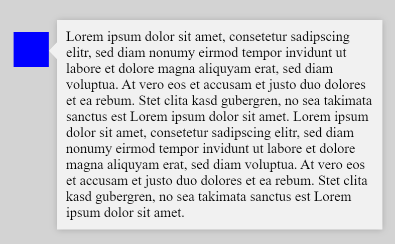
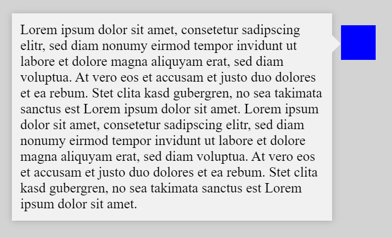
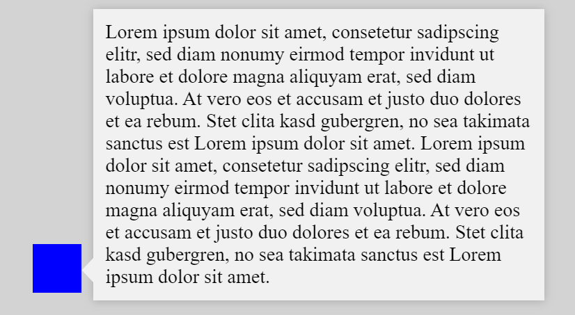
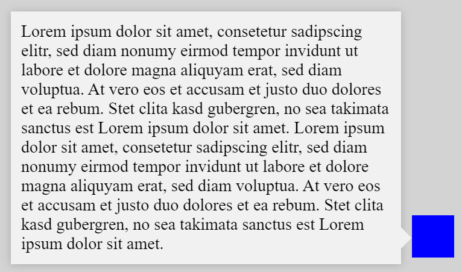
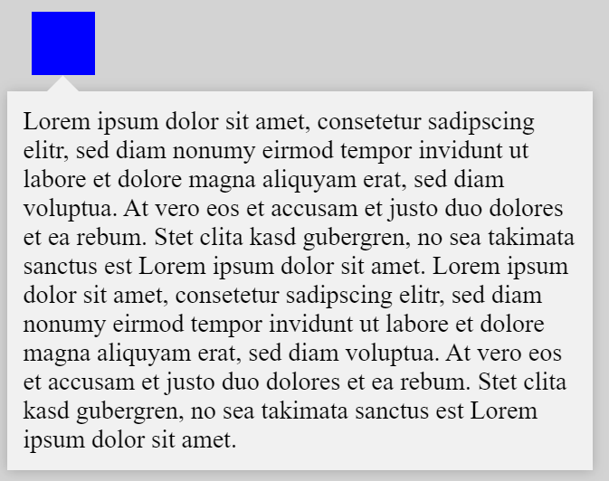
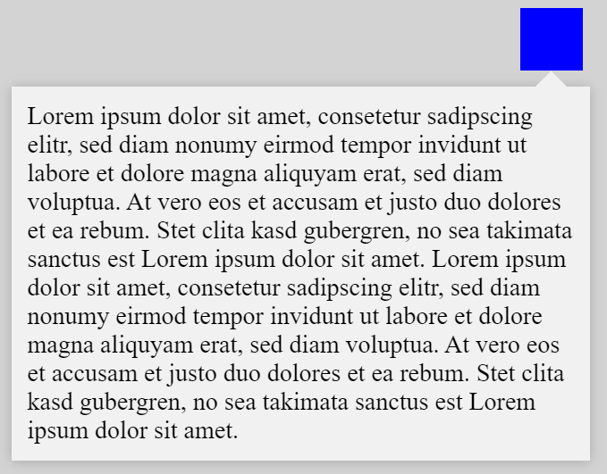
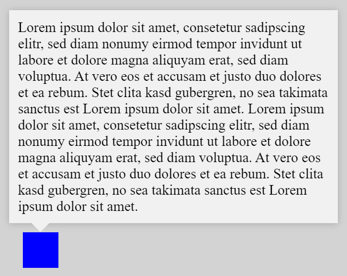
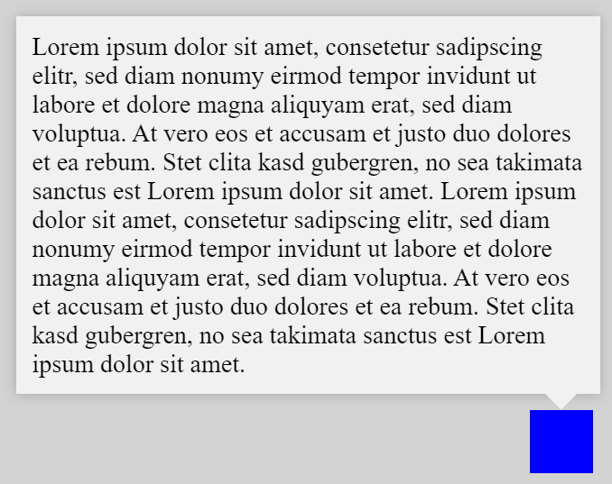

# Angular-Positioned-Popup
A popup which appears at a specific position after the user clicks there.

## Description
This is a generic component to show a popup which is shown at a specific point on the screen after the user clicked there.
- The popup has a latch which points to the location which was clicked.
- The component automatically decides on whether to grow leftward or rightward (leftward if the clicked coordinates are in the right half of the viewport and vice versa).
- The popup automatically decides on whether to grow downward or upward (downward if the clicked coordinates are in the upper half of the viewport and vice versa).
- The component offers the option to position the latch horizontally (to the left or right of the clicked coordinates) or vertically (above or below the clicked coordinates) always pointing toward the clicked coordinates.
- The componenten offers the option to pass the bounding-box of an HTML-Element instead of the exact coordinates of a click. That way, the popup can be positioned relative to e.g. a button indepenent of where exactly the the button the user has clicked.

## Suggestions
- Use CDK-Overlays to show the popup component, as shown in the example application.
- This code is not actively maintained: If you want to use it, update all the dependencies first (mainly Angular).

## Known Issues
- The popup positioning breaks if the browser-window is resized after opening the popup. It then needs to be closed an reopened for the positioning to become correct again.

## Screenshots

### Horizontal Latch
| | |
| --- | --- |
| | |
| | |
| | |

### Vertical Latch
| | |
| --- | --- |
| | |
| | |
| | |

